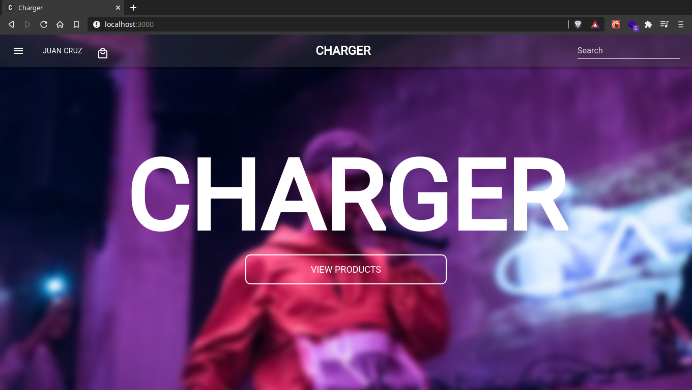
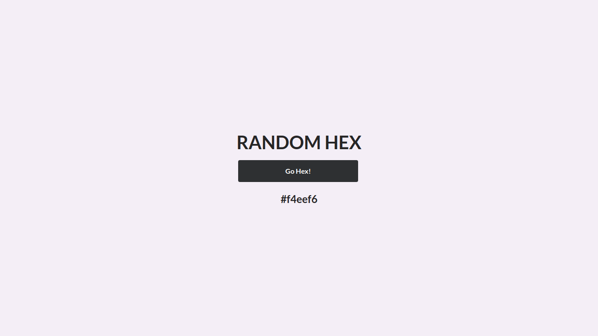

# **Fullstack Developer** :computer: :penguin:
¡Hola! Me llamo Juan Cruz, soy Fullstack Developer, con un amor especial al Frontend.

Tengo 21 años y, gracias al confinamiento, empecé a desarrollarme como Dev.

Apasionado por la tecnología, la música y la fotografía. Me encanta aprender cosas nuevas y rápido, para poder sacarle el mejor provecho a todo lo nuevo que aprendo.

Desde que empecé con el desarrollo web, me enamoré completamente, con el simple hecho de que no existe limite alguno, solo la imaginación.

---
Actualmente estoy trabajando en [<Web Dev Resources>](https://github.com/JuanCruzLescano/web-dev-resources) :point_right: Una pagina que recopila los mejores recursos para el desarrollo web :telescope:

Y aprendiendo Typescript, GraphQL y React Native :seedling:

---

Abajo cito mis mejores proyectos :point_down:

## **Principal projects** :rocket:

- [Charger E-commerce](https://github.com/JuanCruzLescano/charger-ecommerce) Desarrolle un e-commerce completo durante 1 mes, dentro de un equipo de 5 personas mediante metodologías agiles (SCRUM).

## Frontend :nail_care:
- [Random Hex](https://JuanCruzLescano.github.io/random-hex) Es un generador de códigos hexadecimales aleatorio. El source code esta en este [repositorio](https://github.com/JuanCruzLescano/random-hex)

## Fullstack :computer:
- [Cliente Users](https://github.com/JuanCruzLescano/test-fullstack-client) Aplicación simple para agregar usuario, parte de un test técnico.

## Stats :star:

<!--
**JuanCruzLescano/JuanCruzLescano** is a ✨ _special_ ✨ repository because its `README.md` (this file) appears on your GitHub profile.

Here are some ideas to get you started:

- 🔭 I’m currently working on ...
- 🌱 I’m currently learning ...
- 👯 I’m looking to collaborate on ...
- 🤔 I’m looking for help with ...
- 💬 Ask me about ...
- 📫 How to reach me: ...
- 😄 Pronouns: ...
- ⚡ Fun fact: ...
-->
