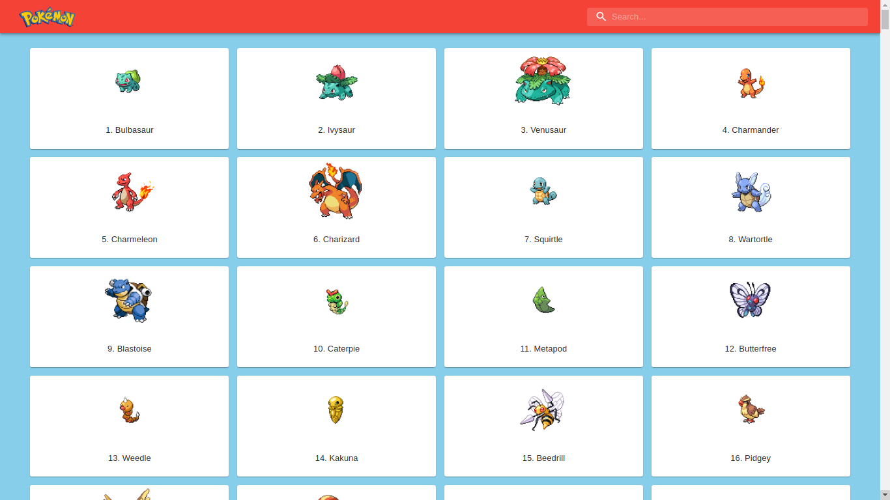
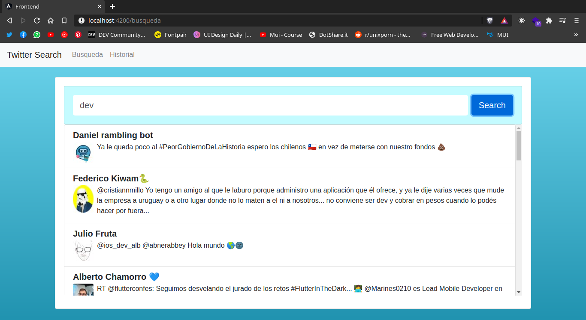

# **Fullstack Developer** :computer: :penguin:
¡Hola! Me llamo Juan Cruz, soy Fullstack Developer, con un amor especial al Frontend.

Tengo 21 años y, gracias a la pandemia, empecé a desarrollarme como Developer.

Apasionado por la tecnología, la música y la fotografía. Me encanta aprender cosas nuevas y de una forma rápida, para poder sacarle el mejor provecho a todo lo nuevo que aprendo.

Me enamoré de la programación ni bien empecé, por el solo hecho de que el único limite es la imaginación de uno `(bastante cliché, pero verdadero)`.

---

Abajo cito mis mejores proyectos :point_down:

## **Principal projects** :rocket:

- [Charger E-commerce](https://github.com/JuanCruzLescano/charger-ecommerce) Desarrolle un e-commerce completo durante 1 mes, dentro de un equipo de 5 personas mediante metodologías agiles (SCRUM).

## Frontend :nail_care:
- [Random Hex](https://JuanCruzLescano.github.io/random-hex) Es un generador de códigos hexadecimales aleatorio. El source code esta en este [repositorio](https://github.com/JuanCruzLescano/random-hex)

- [PokedexMui](https://github.com/JuanCruzLescano/pokedex-mui) Es una pokedex hecha con Material UI, consumiendo la [Pokeapi](https://pokeapi.co/)

## Angular projects :computer:
- [Twitter Search](https://github.com/JuanCruzLescano/angular-twitter-search) :bird: Aplicación para buscar twits con palabras consumiendo la API de Twitter. Es una aplicacion de dos partes, tanto backend como frontend. En la parte del server, se utiliza Express junto con Sequelize con PostgreSQL para guardar el historial de las busquedas realizadas. :rocket:

## Stats :star:

---
## Mis competencias son :100: 

- **Git:** Conozco sus comandos básicos y utilizo github como plataforma principal de todos mis proyectos, por lo que conozco al utilizarla teórica y practicamente.
- **Javascript avanzado:** Comenzando por estructuras de datos y algoritmos, pasando por Hoisting y Closures, y llegando a Promesas, functiones constructoras, ES6, Programación orientada a objetos, etc.
- **React:** Desde lo más básico de la librería, desarrollando pequeños proyectos con lo aprendido. Hasta finalizar con conocimientos de React Hooks, estados, lifecycle, rutas, etc.
- **Redux:** Lo he utilizado en proyectos React para mantener estados globales y realizar proyectos más facilmente escalables.
- **Material - UI:** Creación de paginas web "mobile-first" y responsives, donde me aseguro de que esta pueda ser vista desde cualquier dispositivo.
- **Angular:** Lo más basico del framework, aún aprendiendo.
- **Node.js:** Conozco modulos de terceros y crear los nuestros propios. Conozco las librerías nativas de Node.js y las principales librerías externas que necesito.
- **Webpack + Babel:** Sé configurarlo y preparar un proyecto donde podrémos utilizar todas las funcionalidades de ES6 y JSX en el navegador. Configuramos además un entorno de pruebas para poder ver los cambios en tiempo real y optimizar al máximo el tiempo.
- **Express:** Sé crear APIs propias y servidores webs para ser consumidos por el frontend o por el navegador. Soy capaz de crear rutas con diferentes contenidos cada una. Utilizar middlewares para aumentar las funcionalidades de los programas.
- **Unit testing:** Utilización de los principales frameworks y Test Runners para el correcto testeo de cada elemento de una alicación, así como la metodología de `Desarrollo guiado por pruebas` o `TDD`.
- **PostgreSQL:** Diseño e implementación de base de datos relacional.
- **Sequelize:** Agilización en la implementación de bases de datos relacionales, creación de modelos que pueden ser entendidos por cualquier persona, interacción con la base de datos de manera sencilla.

<!--
**JuanCruzLescano/JuanCruzLescano** is a ✨ _special_ ✨ repository because its `README.md` (this file) appears on your GitHub profile.

Here are some ideas to get you started:

- 🔭 I’m currently working on ...
- 🌱 I’m currently learning ...
- 👯 I’m looking to collaborate on ...
- 🤔 I’m looking for help with ...
- 💬 Ask me about ...
- 📫 How to reach me: ...
- 😄 Pronouns: ...
- ⚡ Fun fact: ...
-->
